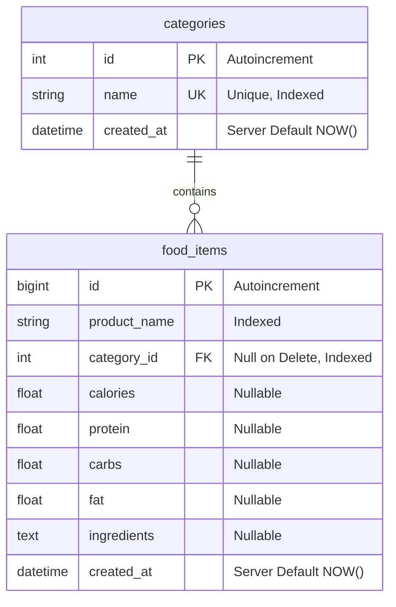
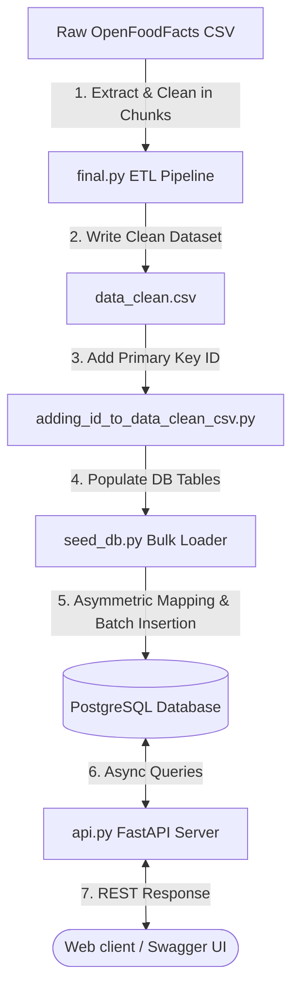

# 🍽️ AI Food Search & Categorization Engine

A high-performance, asynchronous ETL (Extract, Transform, Load) pipeline and web service built with **FastAPI**, **SQLAlchemy 2.0 (Async)**, and **Pandas**. This application cleans, normalizes, filters, and classifies millions of records from the OpenFoodFacts dataset into a structured PostgreSQL database, then exposes a rich REST API for paginated browsing and search.

---

## 🚀 Key Features

*   **Advanced ETL Pipeline (`final.py`)**:
    *   **Chunked Processing**: Handles large datasets efficiently using Pandas chunking.
    *   **Text Normalization**: Standardizes character sets (ASCII normalization, NFKD unicode flattening, lowercase conversion).
    *   **Heuristic Language Filtering**: Isolates English-language products using character metrics and vocabulary indicators.
    *   **Non-Food Filtering**: Detects and purges non-food consumer items (e.g., shampoos, cosmetics, lotions) using regex heuristics.
    *   **Relational Taxonomy Engine**: Maps unstructured product listings into **16 distinct nutrition categories** using hierarchical taxonomy keyword matching and manual overrides.
*   **Asynchronous Database Core (`database.py` & `models.py`)**:
    *   Powered by SQLAlchemy 2.0 async engine and `asyncpg`.
    *   Automatic table generation on startup.
    *   Relational model design linking `categories` to `food_items` with cascaded references.
*   **High-Throughput Seeder (`seed_db.py`)**:
    *   Upserts unique categories safely using PostgreSQL `ON CONFLICT DO NOTHING`.
    *   Trashes stale food entries with clean transaction cascades.
    *   Executes high-speed bulk insertions of processed food items in adjustable batches (default `2,000` records per transaction).
*   **Async FastAPI Web Service (`api.py`)**:
    *   Full-text search endpoint scanning both product names and ingredients.
    *   Paginated list controllers for browsing products and categories.
    *   Categorized querying and direct lookups by unique identifiers.

---

## 📁 Repository Structure

```text
search_text_opensource_dataset/
│
├── adding_id_to_data_clean_csv.py    # Utility script to append auto-increment IDs to CSV
├── data_clean.csv                     # Processed and classified clean dataset (generated)
│
└── search_text_opensource_dataset/    # Main package folder
    ├── 1stdata/                       # Source directory containing raw OpenFoodFacts CSVs
    ├── __init__.py
    ├── .env                           # Configuration and DB credentials (git-ignored)
    ├── api.py                         # FastAPI web application endpoints and lifespan
    ├── database.py                    # Async connection pool & SQLAlchemy session configuration
    ├── final.py                       # ETL, text normalization, and taxonomy parsing engine
    ├── models.py                      # SQLAlchemy 2.0 Relational Models (declarative mapping)
    ├── requirements.txt               # Declared package dependencies
    └── seed_db.py                     # High-performance async database bulk loader
```

---

## 🛠️ Technology Stack

*   **Language**: Python 3.10+
*   **Web Framework**: FastAPI (0.110.0) + Uvicorn (0.29.0)
*   **Data Science / ETL**: Pandas (>= 1.5.0)
*   **Database**: PostgreSQL
*   **ORM**: SQLAlchemy (>= 2.0.0) with `asyncpg` driver
*   **Configuration**: python-dotenv & pydantic-settings

---

## 📊 Database Schema Design

The database represents a clean **1-to-Many** relationship between Categories and Food Items.



---

## 🔍 The ETL & Categorization Pipeline

The processing pipeline (`final.py`) normalizes raw OpenFoodFacts data and applies a highly structured taxonomy map:

### 1. Cleaning & Normalization
*   **Unicode Processing**: Strips accents and converts text columns to clean ASCII strings.
*   **Numeric Sanitation**: Eliminates items with negative or null values for calories, protein, carbohydrates, or fats, rounding values to `3` decimal places.
*   **Duplicate Elimination**: Combines product name and nutritional values into a custom deduplication key to eliminate redundant listings.

### 2. Taxonomy Categories
Products are dynamically sorted into the following categories:
1.  **Soups**: Soups, broths, bouillons, bisques, and chowders.
2.  **Supplements**: Protein powders, meal-replacement bars, whey, collagen, and vitamins.
3.  **Sauces & Condiments**: Ketchup, mayonnaise, dressings, dips, vinegar, and marinades.
4.  **Beverages**: Juices, sodas, water, teas, coffees, and alcoholic beverages.
5.  **Sweets & Desserts**: Cakes, chocolates, ice creams, candies, pastries, and cookies.
6.  **Breakfast Foods**: Cereals, oats, granolas, mueslis, pancakes, and jams.
7.  **Snacks**: Potato chips, crackers, pretzels, energy bars, and trail mixes.
8.  **Fast Food**: Burgers, pizzas, wraps, sandwiches, tacos, and instant noodles.
9.  **Grains & Carbs**: Breads, rices, pastas, grains, flours, and tortillas.
10. **Protein Foods**: Meats, poultry, seafood, eggs, tofu, and legumes (beans, lentils).
11. **Dairy & Alternatives**: Milk, cheese, yogurts, plant-based milks, and butter.
12. **Fats & Oils**: Olive oil, vegetable oils, ghee, lard, and margarine.
13. **Fruits**: Apples, bananas, berries, citruses, and exotic fruits.
14. **Vegetables**: Tomatoes, potatoes, leafy greens, onions, and cruciferous vegetables.
15. **Restaurant Meals**: Cafe, takeaway, bistro, and dining hall offerings.
16. **Home-Cooked Meals**: Homemade stews, casseroles, and family-style meals.
17. **Other**: Default fallback category for items that don't match other definitions.

---

## 🔄 Code Execution Steps

This section details how data travels through the various code modules, from raw CSV ingestion to dynamic JSON serving over HTTP:



### 1. Data Cleaning & ETL — [final.py](file:///c:/Users/Bitech-Office/Documents/search_text_opensource_dataset/search_text_opensource_dataset/final.py)
*   **Chunked Ingestion**: Reads the massive raw OpenFoodFacts products CSV file in memory-safe chunks of `100,000` rows.
*   **Sanitization**: Converts string values to lowercase, normalizes accents (using NFKD unicode flattening), and rounds critical macronutrients and calories to `3` decimal places.
*   **Non-Food Eviction**: Detects and purges non-food consumer items (soaps, shampoos, cosmetics) using a strict regex pattern.
*   **English Language Filter**: Validates text columns by verifying the ASCII character ratio is $>90\%$ and ensuring common English food vocabulary terms (like *chicken*, *milk*, *bread*) are present.
*   **Taxonomy Engine**: Runs multi-tier regex matching to map raw text rows to one of 16 custom food groups, applying explicit overrides (e.g. *coca-cola* $\to$ *Beverages*), before writing clean outputs to `data_clean.csv`.

### 2. Auto-Increment ID Generation — [adding_id_to_data_clean_csv.py](file:///c:/Users/Bitech-Office/Documents/search_text_opensource_dataset/adding_id_to_data_clean_csv.py)
*   Parses the freshly written `data_clean.csv`.
*   Inserts a new primary key `id` column at the beginning of the schema, numbering rows sequentially from `1`.
*   Saves the dataset, readying it for high-fidelity database migrations.

### 3. Database Relational Layer — [database.py](file:///c:/Users/Bitech-Office/Documents/search_text_opensource_dataset/search_text_opensource_dataset/database.py) & [models.py](file:///c:/Users/Bitech-Office/Documents/search_text_opensource_dataset/search_text_opensource_dataset/models.py)
*   Establishes async engine connections with the PostgreSQL database using `asyncpg`.
*   Declares mapped structures:
    *   `Category`: Holds unique, indexed group names.
    *   `FoodItem`: Holds product attributes (name, nutrients, ingredients) and references the category via a foreign key `category_id`.

### 4. High-Performance Seeding — [seed_db.py](file:///c:/Users/Bitech-Office/Documents/search_text_opensource_dataset/search_text_opensource_dataset/seed_db.py)
*   **Table Init**: Creates all schemas automatically in PostgreSQL on start.
*   **Dynamic Upsert**: Extracts unique categories from the CSV and uses `ON CONFLICT DO NOTHING` statements to safely load categories.
*   **Clean Slate**: Truncates any stale food records using a cascade query to prevent duplicates.
*   **Batch Insert**: Maps categories to database IDs and batch-inserts the final records in high-performance chunks of `2,000` rows using PostgreSQL native bulk insert routines.

### 5. Web Serving — [api.py](file:///c:/Users/Bitech-Office/Documents/search_text_opensource_dataset/search_text_opensource_dataset/api.py)
*   Hosts the FastAPI application using the Uvicorn ASGI runner.
*   Serves paginated list, retrieval, and full-text search APIs that query the database asynchronously, yielding optimized, standard JSON payloads.

---

## ⚙️ Installation & Local Setup

### 1. Prerequisites
Ensure you have the following installed:
*   Python 3.10+
*   PostgreSQL running locally or on a cloud instance

### 2. Configure Database & Environment
Navigate to the source package and create a `.env` file:
```bash
cd search_text_opensource_dataset
```

Create a `.env` file with the following variables:
```ini
DATABASE_URL=postgresql+asyncpg://<username>:<password>@localhost:5432/<database_name>
```

### 3. Install Dependencies
Set up a python virtual environment and install the required modules:
```bash
python -m venv venv
# On Windows
venv\Scripts\activate
# On macOS/Linux
source venv/bin/activate

pip install -r requirements.txt
```

### 4. Run the ETL Pipeline
To process the raw dataset and generate `data_clean.csv`:
```bash
python final.py
```

Optional: To append an auto-incrementing ID directly to the CSV file:
```bash
python ../adding_id_to_data_clean_csv.py
```

### 5. Seed the PostgreSQL Database
Populate your database with the categories and products:
```bash
python seed_db.py
```

### 6. Launch the FastAPI Development Server
Use Uvicorn to host the application:
```bash
uvicorn api:app --reload
```
The interactive Swagger API documentation will be available at `http://127.0.0.1:8000/docs`.

---

## 🔌 API Endpoints Documentation

### 1. Base Information
*   **URL**: `GET /`
*   **Description**: Verifies that the API service is alive.
*   **Response**:
    ```json
    {
      "message": "API is running 🚀"
    }
    ```

### 2. Retrieve All Categories
*   **URL**: `GET /categories`
*   **Description**: Fetch all available food categories, sorted alphabetically.
*   **Response**:
    ```json
    {
      "success": true,
      "count": 17,
      "data": [
        { "id": 1, "name": "Beverages" },
        { "id": 2, "name": "Breakfast Foods" }
      ]
    }
    ```

### 3. Retrieve Specific Category
*   **URL**: `GET /categories/{category_id}`
*   **Description**: Get details of a single category by its ID.
*   **Response**:
    ```json
    {
      "success": true,
      "data": {
        "id": 1,
        "name": "Beverages"
      }
    }
    ```

### 4. Paginated Food List
*   **URL**: `GET /foods`
*   **Query Parameters**:
    *   `limit` (int, default=50): Number of rows to return.
    *   `skip` (int, default=0): Number of rows to offset.
*   **Description**: Get a list of all food items with integrated category names.
*   **Response**:
    ```json
    {
      "success": true,
      "count": 50,
      "data": [
        {
          "id": 1,
          "product_name": "organic soy milk",
          "category_id": 1,
          "category": "Beverages",
          "calories": 45.0,
          "protein": 3.0,
          "carbs": 4.0,
          "fat": 1.8,
          "ingredients": "organic soybeans, water, sea salt"
        }
      ]
    }
    ```

### 5. Food Full-Text Search
*   **URL**: `GET /foods/search`
*   **Query Parameters**:
    *   `q` (str, required): Search term (minimum 2 chars).
    *   `top_n` (int, default=10): Maximum results to fetch (1-100).
*   **Description**: Returns matches checking both product names and ingredients list (case-insensitive).
*   **Response**:
    ```json
    {
      "success": true,
      "count": 2,
      "data": [
        {
          "id": 15,
          "product_name": "creamy tomato soup",
          "category_id": 4,
          "category": "Soups",
          "calories": 70.0,
          "protein": 1.5,
          "carbs": 12.0,
          "fat": 2.5,
          "ingredients": "organic tomatoes, milk, garlic, basil"
        }
      ]
    }
    ```

### 6. Query Food by ID
*   **URL**: `GET /foods/{food_id}`
*   **Description**: Retrieve the nutritional values and data for a specific food.
*   **Response**:
    ```json
    {
      "success": true,
      "data": {
        "id": 15,
        "product_name": "creamy tomato soup",
        "category_id": 4,
        "category": "Soups",
        "calories": 70.0,
        "protein": 1.5,
        "carbs": 12.0,
        "fat": 2.5,
        "ingredients": "organic tomatoes, milk, garlic, basil"
      }
    }
    ```

---

## 🛡️ Code Review & Future Recommendations

During code assessment, the following architectural upgrades were identified to boost performance, portability, and robust typing:

### 1. Leverage Pydantic Schemas
*   **Current State**: Raw dictionary mappings in `api.py` (e.g., `food_to_dict` and `cat_to_dict`).
*   **Recommendation**: Define concrete **Pydantic v2 schemas** (e.g. `FoodResponse`, `CategoryResponse`). This provides automated validation, type-safe serialization, and generates fully typed Swagger schemas automatically in Swagger UI.

### 2. Portability of CSV File Paths
*   **Current State**: `seed_db.py` contains a hardcoded absolute Windows path mixed with `os.path.join`:
    ```python
    CSV_PATH = os.path.join(BASE_DIR, "C:\\Users\\Bitech-Office\\Downloads\\search_text_opensource_dataset\\data_clean.csv")
    ```
*   **Recommendation**: Use standard relative directory resolving to make the project instantly runnable on any local, dockerized, or remote machine:
    ```python
    CSV_PATH = os.path.join(os.path.dirname(BASE_DIR), "data_clean.csv")
    ```

### 3. Database Search Optimization (Trigrams & Indexing)
*   **Current State**: Search query uses `like(pattern)` where `pattern = f"%{q.lower()}%"`.
*   **Recommendation**: In PostgreSQL, the standard B-Tree index is bypassed when using a leading wildcard (`%search`). On large datasets, this triggers expensive full-table scans.
    *   *Upgrade*: Install the PostgreSQL `pg_trgm` extension and define a **GIN index** on `product_name` and `ingredients` columns to enable high-speed partial text matching:
        ```sql
        CREATE EXTENSION IF NOT EXISTS pg_trgm;
        CREATE INDEX idx_food_items_product_name_trgm ON food_items USING gin (product_name gin_trgm_ops);
        ```

### 4. Logging & Config Management
*   **Current State**: Directly calling `print()` for console statements.
*   **Recommendation**: Integrate Python's `logging` module to allow standardized level control (`INFO`, `DEBUG`, `ERROR`) and log persistence when deployed to remote staging or production environments.
